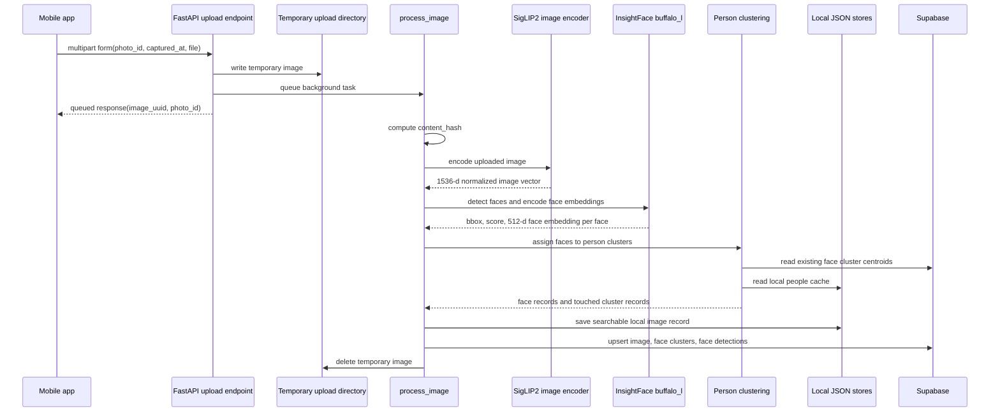

# Smart Gallery Upload Pipeline

This document describes the backend pipeline that runs when a photo is uploaded
to Smart Gallery. The pipeline creates a searchable image vector, detects and
clusters faces, persists metadata, and removes the temporary upload file.

## Entry Point

The mobile app uploads photos through:

```http
POST /api/upload
```

The endpoint is implemented in:

```text
backend/app/api/endpoints/upload.py
```

The request is a multipart form:

```text
photo_id     required string
captured_at  optional ISO timestamp
file         required image file
```

The authenticated user id comes from `get_current_user_id`. The endpoint creates
a new backend image UUID with `uuid4()`, writes the uploaded file to a temporary
path, and queues the heavy work as a FastAPI background task.

Temporary file path:

```text
tmp/smart_gallery_uploads/{photo_id}_{original_filename}
```

Background task call:

```python
process_image(
    image_path=tmp_path,
    user_id=user_id,
    photo_id=photo_id,
    image_uuid=image_uuid,
    captured_at=captured_at,
)
```

Immediate API response:

```json
{
  "status": "success",
  "message": "Image queued for processing",
  "photo_id": "<client-photo-id>",
  "user_id": "<resolved-user-id>",
  "image_uuid": "<generated-backend-uuid>"
}
```

The original image binary is temporary. The backend keeps metadata and vectors,
not a permanent copy of the uploaded image file.

## High-Level Sequence



## Models

| Purpose | Library | Model | Output |
| --- | --- | --- | --- |
| Image vectors | Hugging Face Transformers | `google/siglip2-giant-opt-patch16-384` | 1536-d normalized vector |
| Text query vectors | Hugging Face Transformers | `google/siglip2-giant-opt-patch16-384` | 1536-d normalized vector |
| Face detection | InsightFace | `buffalo_l` | face bbox and detection score |
| Face identity vectors | InsightFace | `buffalo_l` | 512-d face embedding |

The SigLIP2 model is used for visual search. The InsightFace model is used for
people albums.

## Processing Order

The background pipeline is implemented in:

```text
backend/app/services/pipeline.py
```

### 1. Supabase Client

`process_image(...)` first tries to create a Supabase client from environment
configuration. If this succeeds, the pipeline writes both local and remote
metadata. If it fails, the pipeline still writes the local JSON index.

### 2. Content Hash

The pipeline computes a SHA-256 hash over the uploaded image bytes:

```text
image bytes -> SHA-256 -> content_hash
```

The local search index stores this hash so duplicate local records can be
identified by file content.

### 3. SigLIP2 Image Embedding

Image embedding is implemented in:

```text
backend/app/services/embedding_service.py
```

Model constants:

```text
MODEL_NAME = google/siglip2-giant-opt-patch16-384
EMBEDDING_DIMENSION = 1536
```

Runtime behavior:

```text
1. Pick device: cuda, then mps, then cpu.
2. Load AutoProcessor and AutoModel.
3. Open image with Pillow.
4. Convert image to RGB.
5. Preprocess image with the SigLIP2 processor.
6. Run model.get_image_features(...).
7. L2-normalize the output vector.
8. Return a Python list of 1536 floats.
```

The stored image vector is used later for text-to-image search.

### 4. InsightFace Detection And Face Embeddings

Face detection is implemented in:

```text
backend/app/services/face_service.py
```

The upload pipeline calls:

```python
detect_and_encode_faces_with_attempt(
    image_path,
    detection_mode="expensive",
)
```

The `expensive` mode currently maps to one full-frame attempt:

```text
model name       = buffalo_l
det_size         = (640, 640)
det_thresh       = 0.40
min_face_score   = 0.40
target_max_edge  = None
target_min_edge  = None
crop_ratio       = None
rotation_angle   = None
```

The image is read with OpenCV. For each accepted face, InsightFace returns a
detector score, bounding box, and face embedding. The backend keeps:

```text
bbox       bounding box remapped to original image coordinates
embedding  512-dimensional InsightFace face embedding
score      detector confidence
```

The face embedding is used for person clustering. It is separate from the
1536-dimensional SigLIP2 image search vector.

### 5. Person Cluster Assignment

Person clustering is implemented in:

```text
backend/app/services/people_service.py
```

The pipeline calls:

```python
assign_faces_to_clusters(
    user_id=user_id,
    image_uuid=image_uuid,
    photo_id=photo_id,
    faces=faces,
    captured_at=captured_at,
)
```

If the image has no accepted faces, clustering returns immediately with no face
records and no cluster records.

When faces exist, clustering loads existing person clusters from two places:

```text
Supabase face_clusters table
backend/tmp/local_people_index.json
```

Supabase cluster fields read for matching:

```text
id
user_id
name
centroid
sample_count
cover_image_uuid
cover_photo_id
updated_at
```

The local and Supabase cluster lists are normalized and merged by cluster id.
Each cluster is represented by a centroid vector. The centroid is the running
average of face embeddings assigned to that person.

For each detected face:

```text
1. Parse the 512-d face embedding.
2. Compare it to every existing cluster centroid with cosine similarity.
3. Keep the cluster with the highest similarity score.
4. If best_score < 0.40, create a new cluster named Person N.
5. If best_score >= 0.40, assign the face to that cluster.
6. Update the assigned cluster centroid and sample_count.
7. Record the face bounding box as a detection.
```

Cluster thresholds:

```text
FACE_MATCH_THRESHOLD = 0.40
FACE_MATCH_THRESHOLD_SAME_IMAGE = 0.68
```

`FACE_MATCH_THRESHOLD` controls whether a detected face joins an existing person
cluster. `FACE_MATCH_THRESHOLD_SAME_IMAGE` is used when the same uploaded image
contains multiple faces and a second face would otherwise map to a cluster that
was already used in that image.

Existing cluster update formula:

```text
new_centroid = ((current_centroid * sample_count) + incoming_embedding) / (sample_count + 1)
sample_count = sample_count + 1
```

New cluster shape:

```text
id                generated UUID
user_id           owner id
name              Person N
centroid          incoming 512-d face embedding
sample_count      1
cover_image_uuid  current image UUID
cover_photo_id    current photo id
updated_at        current UTC timestamp
```

For every assigned face, the pipeline receives a face record:

```text
cluster_id
cluster_name
bounding_box
image_uuid
photo_id
captured_at
```

The function also returns touched cluster records. These are the clusters that
were created or updated during this upload.

### 6. Local Persistence

The local searchable image index is stored in:

```text
backend/tmp/local_search_index.json
```

Each local image record contains:

```text
uuid
user_id
photo_id
embedding
persons
content_hash
face_clusters
captured_at
```

`persons` is derived from assigned face cluster names. `face_clusters` stores
cluster id/name references for the uploaded image.

Local people data is stored in:

```text
backend/tmp/local_people_index.json
```

It contains:

```text
clusters    person cluster metadata and centroids
detections  per-image face detections and bounding boxes
```

### 7. Supabase Persistence

If Supabase is configured, the pipeline first upserts the image row:

```text
table       images
conflict    user_id, photo_id
```

Image row payload:

```text
uuid
user_id
photo_id
embedding
persons
captured_at
```

Then the pipeline upserts every touched person cluster:

```text
table       face_clusters
conflict    id
```

Face cluster payload:

```text
id
user_id
name
centroid
sample_count
cover_image_uuid
cover_photo_id
updated_at
```

Finally, the pipeline inserts face detections:

```text
table face_detections

image_uuid
cluster_id
bounding_box
```

The Supabase cluster centroid column must store 512-dimensional InsightFace face
vectors. The project includes the SQL needed for these columns:

```text
backend/supabase_face_cluster_centroids.sql
```

Required `face_clusters` centroid schema:

```sql
centroid vector(512)
sample_count integer not null default 1
cover_image_uuid uuid
cover_photo_id text
updated_at timestamptz not null default now()
```

### 8. Cleanup

The temporary upload file is deleted in the `finally` block of
`process_image(...)`. Cleanup runs after successful processing and after handled
pipeline failures.

## Search Pipeline

Search is handled by:

```text
backend/app/services/search_service.py
```

The endpoint is:

```http
GET /api/search?q=<query>&limit=<n>
```

Search order:

```text
1. Trim the query string.
2. Encode the query with SigLIP2 text features.
3. L2-normalize the 1536-d query vector.
4. Query Supabase RPC match_images when available.
5. Rank local JSON records with cosine similarity.
6. Scan Supabase images in Python when RPC search is unavailable.
7. Merge ranked local and remote results by image identity.
8. Return serialized search results.
```

Query embedding behavior:

```text
query text -> SigLIP2 processor -> model.get_text_features(...) -> normalized 1536-d vector
```

Image ranking score:

```text
cosine_similarity(query_embedding, image_embedding)
```

Serialized search result:

```text
image_uuid
photo_id
score
persons
captured_at
match_reason
```

Remote search uses the `match_images` RPC with:

```text
query_embedding
filter_user_id
match_count
```

The `images.embedding` column and `match_images` RPC must use 1536-dimensional
SigLIP2 vectors.

## Data Ownership

All image records, people clusters, and face detections are scoped by `user_id`.
During upload, the user id comes from the authenticated request. During search
and people listing, the backend filters records to the current user.

## Failure Behavior

The upload endpoint only confirms that the file was queued for background
processing. Model or persistence failures happen inside `process_image(...)` and
are logged server-side.

Stage failure behavior:

```text
Supabase unavailable     local JSON persistence continues
image embedding error    zero 1536-d vector is returned
query embedding error    zero 1536-d vector is returned
face analysis error      zero faces are returned
zero detected faces      image is indexed without people clusters
cluster fetch error      local people cache is still used
Supabase write error     local records remain available
```

The temporary image file is still deleted when the pipeline exits.
